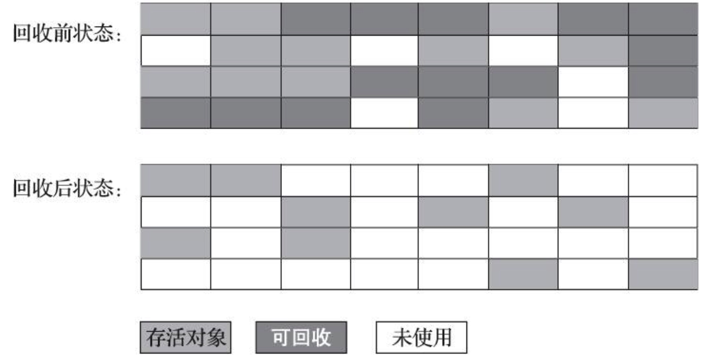
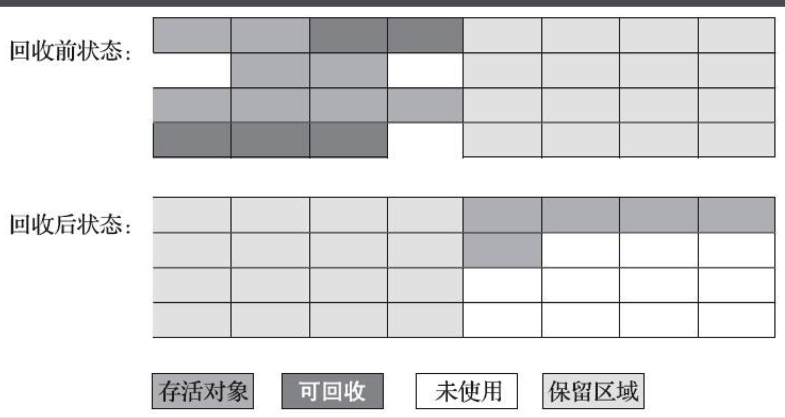
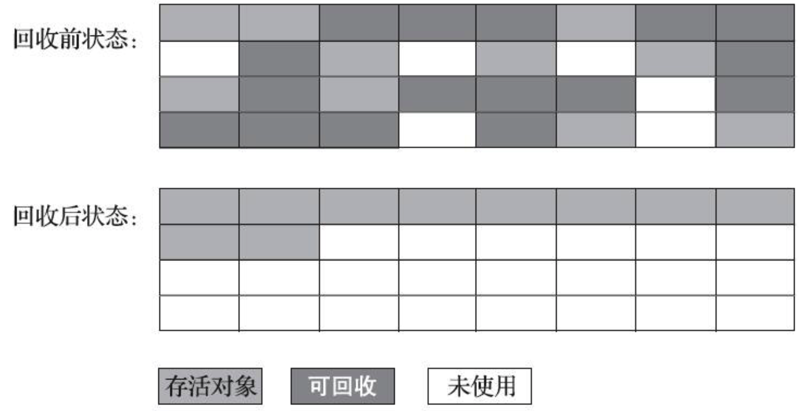

# 垃圾回收算法

## 设计原则

1. “弱分代假说（Weak Generational Hypothesis）：绝大多数对象都是朝生夕灭的。”

2. “强分代假说（Strong Generational Hypothesis）：熬过越多次垃圾收集过程的对象就越难以消亡。”

基于以上两个分代假说，奠定了垃圾收集器的一致设计原则：**收集器应该将Java堆划分出不同的区域，然后将回收对象依据其年龄（年龄即对象熬过垃圾收集过程的次数）分配到不同的区域之中存储。**在Java堆中一般会被设计者划分成新生代和年老代

## 垃圾收集算法

### ✏️ 标记-清除算法

首先标记出所有需要回收的对象，在标记完成后，统一回收掉所有被标记的对象，也可以反过来，标记存活的对象，统一回收所有未被标记的对象。

### ✏️ 标记-复制算法

它将可用内存按容量划分为大小相等的两块，每次只使用其中的一块。当这一块的内存用完了，就将还存活着的对象复制到另外一块上面，然后再把已使用过的内存空间一次清理掉。

### ✏️ 标记-整理算法

其中的标记过程仍然与“标记-清除”算法一样，但后续步骤不是直接对可回收对象进行清理，而是让所有存活的对象都向内存空间一端移动，然后直接清理掉边界以外的内存

